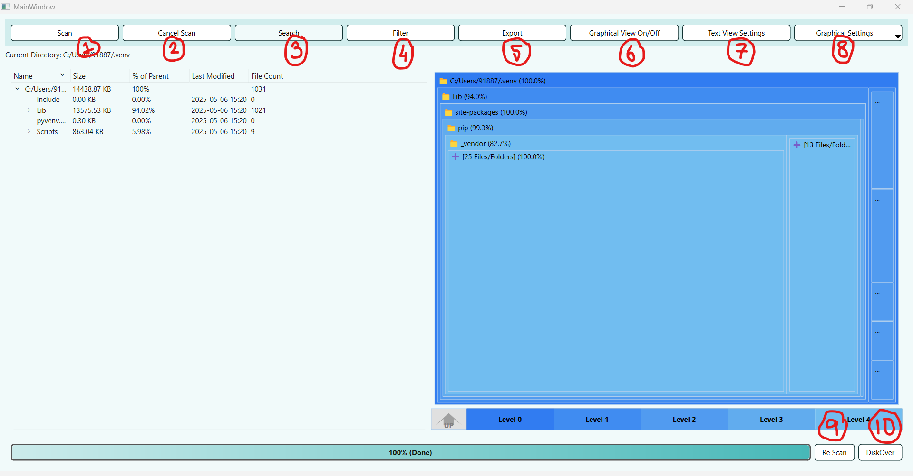
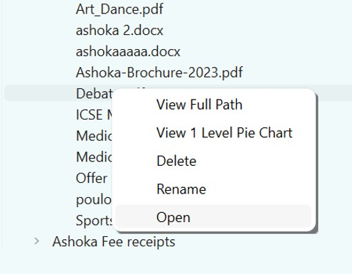

# TreeSize: A Disk Usage Visualizer
**Course:** Design Practices in CS (CS-3810)  
**Semester:** Monsoon 2025  
**Professor:** Prof. Partha Pratim Das  
**Team:** *Bug Dealers*  
**Members:** Poulomi Sarkar, Roshni Pai  
**Date:** October 21, 2025  

### Overview  

**TreeSize** is a desktop application designed to help users analyze disk usage in a clear, intuitive way.  
It allows users to **scan directories**, **view file sizes**, **filter and search results**, **visualize data graphically**, and **manage files** - all from one interface.  

The project was developed as part of *Design Practices in Computer Science* (CS-3810), focusing on modular design, usability, and maintainable software engineering.

`Treesize` in project-1-budealers repository contains the code and commits. 

---
 
### Launching Application 

#### Launching on Windows:

There is a folder on the Git Repository called `WindowsExecutableFinal` which contains `Treesize.exe`

Follow the path: `WindowsExecutableFinal\Treesize.exe`

#### Launching on MacOS:

There is a folder on the Git Repository called `MacExecutableFinal\Tree-size.app\Contents`, which contains MacOS and that contains the final executable called `Treesize`
Follow the path: `MacExecutableFinal\Treesize.app\Contents\MacOS\Treesize`

---

### Interface Explanation

  

### 1. Scan  
Select a directory to analyze using the **Scan** option.
TreeSize will recursively explore all files and folders, displaying their sizes and usage statistics in the Text View.  

---

### 2. Cancel Scan  
If a scan is taking too long or not needed, you can stop it mid-way using the **Cancel Scan** button on the toolbar.  

---

### 3. Search  
Use the **Search** bar to quickly locate specific files or folders by name.  
Results update dynamically as you type.  

---

### 4. Filter  
Filter results based on criteria such as file size, type, or modification date.  
This helps focus on specific files of interest : for example, large files or media types.  

---

### 5. Export  
Export the scan results in multiple formats (e.g., `.csv`, `.txt`, `.json`) for sharing or analysis.  
You can choose the desired file name and path.  

---

### 6. Graphical View (On/Off)  
Toggle between text-based and graphical visualizations of your scan data.  
The graphical view offers pie charts and other visuals for better insight into space usage.  

---

### 7. Text View Settings  
User has two options : Change the font size (8 - 48) and change the display size formats (KB/MB/GB/Bytes).

---

### 8. Graphical Settings 
Option to change the max depth with which we are viewing the directory from the parent. 

---

### 9. Re-Scan  
Use **Re-Scan** to refresh your data after changes (e.g., after deleting or renaming files).  
This automatically updates all views with the latest file system information.  

---

### 10. DiskOver  
The **DiskOver** feature provides free-space and disk-level statistics for the currently scanned directory.  
It helps you monitor storage usage and available space at a glance.

---

## Context Menu Options 

###  Delete  
Right-click a file or folder and select **Delete** to remove it.  
- A confirmation dialog appears before deletion.  
- Files are moved to the **Recycle Bin**, not permanently deleted.  
- A success message confirms completion, and the view is automatically rescanned.  
- If a file is in use, an appropriate warning is displayed.  

### Rename  
Right-click any file or folder → **Rename**.  
You’ll be prompted to enter a new name.  
If a duplicate name exists, the application displays a warning.  
After renaming, a rescan updates the directory view automatically.  

### Open File / Folder  
Right-click and choose **Open**:  
- For folders → opens in File Explorer.  
- For files → opens in the default or associated application (e.g., VS Code for `.cpp`, Word for `.docx`).  

### One-Level Pie Chart  
Right-click on any folder and select **1-Level Pie Chart** to view a graphical breakdown of its immediate contents.  
> Note: This is only available for folders (not files). Attempting to open it for a file will show an error message.  

---

## Implementation Overview  
TreeSize is built using a modular structure, featuring:  
- **Scanning Module** : handles directory traversal and data collection.  
- **TextView & ContextMenu Module** : manages file display and user interactions.  
- **Toolbar & ProgressBar Module** : provides accessible command controls and visual status.  
- **Graphical View Module** : generates dynamic rectnagluar representations of the directory structure. 
- **DiskOver Module** : analyzes free space and disk-level metrics.  

---

## Technologies Used  
- **Language:** C++  
- **Framework**: Qt (6.9.3) 
- **IDE**: Qt Creator 17.0.2 (Community)   
- **Platform:** Windows, Mac OS 
- **Version Control:** GitHub  

---

## Contributors  
- **Poulomi Sarkar** 
- **Roshni Pai** 

---

## Summary  
TreeSize provides a fast, intuitive way to explore and manage disk usage, combining **analytical insights** with **practical management tools** : an elegant solution for visual file system analysis.

